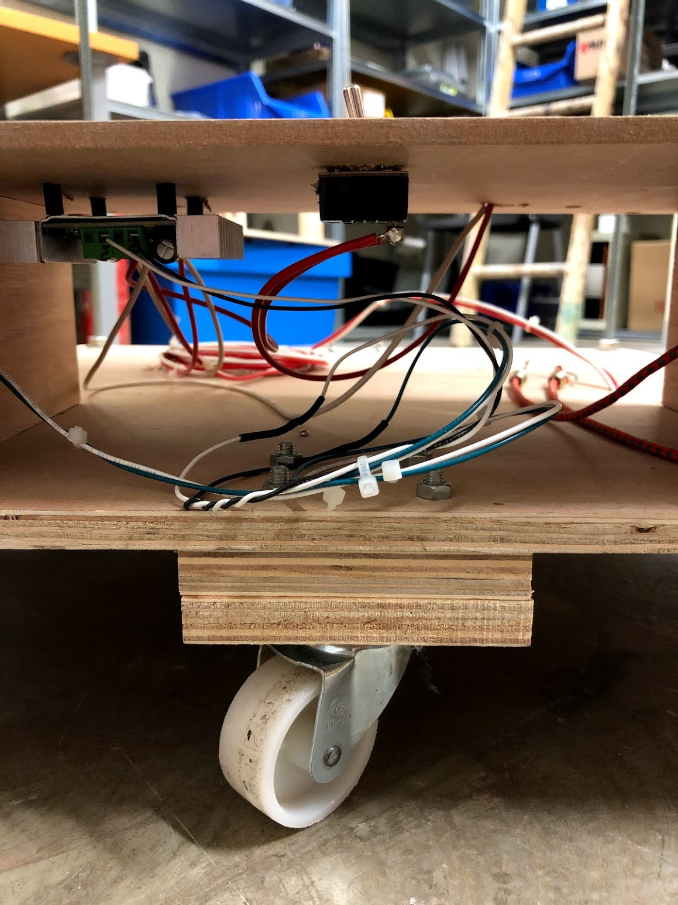

# The Telepresence project

**Table of contents**

*   Introduction
*   Parts & tool choice
*   Theory of Operation
*   Construction
*   References
*   Other Projects
*   Contributors
*   License

Why

Robotic research projects are typically expensive and complicated, and therefore, access to them is highly restricted. Are areas of exploration similarly limited to that proposed by the select group of  researchers? 

The purpose of this project is to widen the pool of participants by creating a simple telepresence platform that is relatively inexpensive, relatively simple, and relatively easy to work on. Being relatively inexpensive, the robot can be in public spaces, inviting curiosity, suggestions, and participation from a wider audience. Being relatively easy to work on, participants with less training can get involved. By using simple construction techniques, common handheld tools can be used and less training is required to make modifications and to add features, further broadening the field of potential participants

By publishing this documentation, our hope is that others might duplicate all or some of this project, make modifications and improvements, further this approach of inviting broader participation in complicated projects, and in general make use of any material here. Therefore, this work is published with the (TBA) license

What

This project describes a telepresence device, i.e, the ability to virtually be at some remote location. Camera, microphone, loudspeaker, and screen project you to the remote location, and project the remote location to your web browser. Navigation controls on your web browser allow you to move the device to different locations and to turn to face different directions.

Technically, this is a simple motorized platform (which I will call a "robot" here, although it has no autonomy, and I hesitate to use the word "robot" for a device with no autonomy) with an onboard Linux computer (Raspberry Pi) and bidirectional audio and video capabilities (screen/camera, loudspeaker/microphone). Basically, video chat on a mobile platform.

The computer runs a web server. Remote visitors access the robot's URL (e.g. from a browser on their phone) and are presented with a basic video chat system: the image from the camera on the phone is visible on the screen of the robot, and the image from the camera on the robot is visible on the screen of the phone._ _Similarly for the audio. In addition, there is a control interface for the mobile platform visible on the phone, which allows the remote visitor to drive the robot around.

How Long

This project was built over a long period of time, not working continuously. With all the necessary parts and tools on hand, construction of the physical platform should take a few days.

How Much

TBA

# To-Do

1. Photos to each step of the instructions - Deigo: identify which photos are missing
2. ~~License - michael diego~~
3. ~~software - michael~~
4. Final result section: summary, next steps - michael 
5. ~~Ming Website video: [https://vimeo.com/302513762](https://vimeo.com/302513762)~~
6. **Updated parts list (prototyping shield) - go over assembly instructions and make sure all parts are here - michael**
7. ~~Context, motivation~~, problems and timeline - michael
8. ~~People involved link their githbus or their portfolio - michael~~
9. ~~Table of contents - diego~~
10. Move to Github. Michael and Diego to discuss.

# Parts & tool choice

There are infinite ways to combine multiple parts to accomplish the goals outlined in the section above. The parts listed here are what I used, but can easily be replaced with other choices. 

The goal of this project is to make itself accessible to the widest possible audience. Therefore, Arduino and Raspberry Pi were chosen, as they are extremely well documented on the web and in books and magazines, and are familiar to the largest number of people relative to other microcontrollers or single board computers.

Wood and aluminum are used to construct the frame. They are inexpensive, readily available, and can easily be worked on by common hand tools and an electric drill. As with the entire project, substitutions can be made easily depending on what’s at hand and easily available.

The motors, wheels, and motor controller were purchased from Super Droid Robots (SDR) because they offered convenient assemblies of wheels, motors, and bearings, avoiding the need for elaborate fabrication. The motor controller, manufactured by Dimension Engineering, was purchased from SDR as well for convenience.

All voltage levels are provided by portable battery packs with USB, 9, and 12 volt outputs.

## Tools List

*   Soldering iron and lead free solder
*   Wire cutter and wire stripper 
*   Pliers: needle nose, regular
*   Heat gun
*   Screwdrivers (#1 Philips, #2 Philips, 2.5mm slotted)
*   Hacksaw for cutting aluminium
*   Hand saw for cutting wood
*   Electric hand drill, drill bits

## Parts list

### Adafruit

*   [Raspberry Pi model 3B+](https://www.adafruit.com/product/3775) Unit Price: $35 
*   [HDMI 4 Pi - 10.1" Display](https://www.adafruit.com/product/1287) Unit Price: $144.95
*   [PureAudio Array Microphone](https://www.adafruit.com/product/3850) Unit Price: $49.95
*   [FTDI Friend](https://www.adafruit.com/product/284) (USB to serial converter to access the console on the Raspberry Pi)
*   [Male-Female jumper wires](https://www.adafruit.com/product/1953) Unit Price: t$1.95

### SuperDroidRobots

**Motors**

*   Qty 2 [TD-044-240 IG42 24VDC 240 RPM Gear Motor with Encoder](https://www.superdroidrobots.com/shop/item.aspx/ig42-24vdc-240-rpm-gear-motor-with-encoder/840/) Unit price: $59.95, Total price: $119.90 \
(these were quite fast, might try a slower motor next time)
*   Qty 2 [TD-044-122 IG42 24VDC 122 RPM Gear Motor with Encoder](https://www.superdroidrobots.com/shop/item.aspx/ig42-24vdc-122-rpm-gear-motor-with-encoder/849/) Unit price: $61.95, Total price: $123.90
*   Qty 1 [TE-183-002 Dual LS7366R Quadrature Encoder Buffer](https://www.superdroidrobots.com/shop/item.aspx/dual-ls7366r-quadrature-encoder-buffer/1523/) Total Price: $45.68
*   Qty 2 [TE-305-003 IG42 IG52 Encoder Connector](https://www.superdroidrobots.com/shop/item.aspx/ig42-ig52-encoder-connector/2432/) Unit Price: $0.95, Total Price: $1.90

**Motor controller**

*   Qty 1 [TE-091-212 Sabertooth Dual 12A Motor Driver](https://www.superdroidrobots.com/shop/item.aspx/sabertooth-dual-12a-motor-driver/1155/) Total Price: $79.99 

**Wheel assemblies**

*   Qty 1 [TD-158-008 ATR Wheel Shaft Set Pair 8mm Bore - 6 inch pneumatic](https://www.superdroidrobots.com/shop/item.aspx/atr-wheel-shaft-set-pair-8mm-bore-6-inch-pneumatic/1989/) Total Price: $66.32 \
This is a pair of 6 inch pneumatic rubber tires with steel rims and a 1/2" steel shaft, 1/2" ID ball bearing for additional support, bored to accept an 8mm motor shaft. Includes: 2 pneumatic wheels, shafts, bearings, collars and hardware.

**Motor Mounting Hardware**

*   Qty 2 [TD-056-342 Motor Mount Tube - IG32 or IG42 SB](https://www.superdroidrobots.com/shop/item.aspx/motor-mount-tube-ig32-or-ig42-sb/2109/) Unit price: $18.00, Total Price: $36.00
*   Qty 2 [TD-053-042 Motor Mount Plate - IG42](https://www.superdroidrobots.com/shop/item.aspx/motor-mount-plate-ig42/2115/) Unit price: $3.45, Total price: $6.90
*   Qty 2 [TD-166-000 IG32 and IG42 Motor Plate Hardware Kit](https://www.superdroidrobots.com/shop/item.aspx/ig32-and-ig42-motor-plate-hardware-kit/2014/) Unit Price: $3.95, Total Price: $7.90
*   Qty 2 [TD-165-412 M4 Steel Mounting Screw, 12mm Length, Pan Head, Phillips Drive (Pack of 16)](https://www.superdroidrobots.com/shop/item.aspx/m4-steel-mounting-screw-12mm-length-pan-head-phillips-drive-pack-of-16/2012/) Unit Price: $1.29, Total Price: $2.58

### 
Power

*   Qty 3 Portable battery packs (one for Raspberry Pi and Arduino, one for the HDMI monitor, and one for the motors): [Talentcell 12V/9V/5V battery pack](https://www.amazon.com/TalentCell-Rechargeable-11000mAh-20000mAh-Portable/dp/B01337QXMA/ref=pd_sbs_23_5/138-5010287-9299945) . The battery pack has separate outputs for 5V, 9V, and 12V. Arduino/Raspberry Pi uses the 5V (USB) output, the monitor uses the 9V output, and the motors use the 12V output. It is entirely possible that the monitor could be combined with the Raspberry Pi and Arduino, or possibly even all three functions on one battery pack, of course depending on how much moving the robot does between charging. 

### Cables and Connectors

    *   Qty 1 [Generic USB A/B](https://store.arduino.cc/usb-2-0-cable-type-a-b) (Raspberry Pi to Arduino) Total Price: $2.49
    *   Qty 1 [Generic USB A to Micro B](https://www.amazon.com/AmazonBasics-Male-Micro-Cable-Black/dp/B0711PVX6Z/) (Battery pack to Raspberry Pi) Total Price: $5.26
    *   Qty 1 [HDMI cable](https://www.adafruit.com/product/608) Total Price: $4.95
    *   2.1mm male coax to screw terminal adapter + 2.1mm female coax to screw terminal adapter - [such as these](https://www.amazon.com/dp/B01J1WZENK/ref=sspa_dk_detail_2?psc=1&pd_rd_i=B01J1WZENK&pd_rd_w=MeYgu&pf_rd_p=48d372c1-f7e1-4b8b-9d02-4bd86f5158c5&pd_rd_wg=qCV5S&pf_rd_r=15QY18EMK4Y0FNANHFTF&pd_rd_r=6d551262-0fe1-4295-a5bd-344e14ef2694&spLa=ZW5jcnlwdGVkUXVhbGlmaWVyPUEyV0tMNTIxQVhYQjJTJmVuY3J5cHRlZElkPUEwNDIwMDc4WEQ2WFZGRlFIQjRIJmVuY3J5cHRlZEFkSWQ9QTA5NzA4ODcyVFZXTEFTVUw2QjJRJndpZGdldE5hbWU9c3BfZGV0YWlsJmFjdGlvbj1jbGlja1JlZGlyZWN0JmRvTm90TG9nQ2xpY2s9dHJ1ZQ==). Total Price: $7.99
    *   Qty 2 [Male header pins](https://www.amazon.com/dp/B07BXDYTBP/ref=sr_1_9?dchild=1&keywords=male+header+pins&qid=1599386779&sr=8-9) (this is a set of 36) Total Price: $7.99
    *   Qty 2 [Female header pins](https://www.amazon.com/Haobase-2-54mm-Straight-Single-Headers/dp/B01DLX6RSQ/ref=sr_1_5?dchild=1&keywords=female+header+pins&qid=1599386828&sr=8-5) Total Price: $5.60

### 
Miscellaneous

*   Qty 2 Castor wheels: generic hardware store. Mine are about 2” diameter. 
*   Zip ties
*   Wood screws, nuts and bolts, sizes as needed
*   Heat shrink tubing (different sizes) - Such as these
*   Lead free solder
*   22 AWG stranded wire (multiple colors) - [Such as these](https://www.amazon.com/LotFancy-Stranded-Electrical-Flexible-insulated/dp/B07Q3G1VG2/ref=sr_1_1_sspa?dchild=1&keywords=22+AWG+stranded+wire&qid=1599388420&sr=8-1-spons&psc=1&spLa=ZW5jcnlwdGVkUXVhbGlmaWVyPUE5QzJQUlI0Q0hZTUMmZW5jcnlwdGVkSWQ9QTA1NjgwMjVLWDU2RFhSVTZONjQmZW5jcnlwdGVkQWRJZD1BMDUwMTUyMjNRU1BTQzU5VU04REcmd2lkZ2V0TmFtZT1zcF9hdGYmYWN0aW9uPWNsaWNrUmVkaXJlY3QmZG9Ob3RMb2dDbGljaz10cnVl)
*   22 AWG solid core wire (multiple colors) - [Such as these](https://www.amazon.com/TUOFENG-Wire-Solid-different-colored-spools/dp/B07TX6BX47/ref=sr_1_1_sspa?dchild=1&keywords=22+AWG+solid+wire&qid=1599388455&sr=8-1-spons&psc=1&spLa=ZW5jcnlwdGVkUXVhbGlmaWVyPUExWks3MFRZN1ZCMTNUJmVuY3J5cHRlZElkPUEwNTA5MjU5MTU2UUkxTUJBRFVVQyZlbmNyeXB0ZWRBZElkPUEwNzkxODc5NktUQVFGT0E2NEpFJndpZGdldE5hbWU9c3BfYXRmJmFjdGlvbj1jbGlja1JlZGlyZWN0JmRvTm90TG9nQ2xpY2s9dHJ1ZQ==)
*   18 AWG stranded wire (multiple colors) - [Such as these](https://www.amazon.com/Electrical-Flexible-Silicone-different-automotive/dp/B07G744V5Z/ref=sr_1_5?dchild=1&keywords=18+AWG+stranded+wire&qid=1599388475&sr=8-5)
*   Arduino prototyping shield (any vendor) - [Such as these](https://www.amazon.com/Gikfun-Prototype-Breadboard-Arduino-Shield/dp/B07RGPZ2RW/ref=sr_1_5?dchild=1&keywords=Arduino+prototyping+shield&qid=1599390952&sr=8-5). 
*   Plastic standoffs and screws for mounting Arduino and Raspberry Pi

# Theory of Operation

As explained above, the aim of this project is to be accessible to as many people as possible. Raspberry Pi and Arduino were chosen for this reason.

The Arduino handles communication to the motor controller and is available for easy attachment of other sensors and actuators. The Raspberry Pi handles the video chat and networking and communicates with (and powers) the Arduino via a standard USB cable and the Arduino Serial port.

Arduino communicates with the motor controller over a software serial port. While this sets up a bidirectional communication channel, only one direction (Arduino to motor controller) is used. Although the other pin isn’t connected, it can not be used for anything else. Perhaps the unused pin should be connected to ground to avoid a floating input.

The Raspberry Pi communicates with the Arduino using a standard virtual serial port over USB. A simple one letter serial protocol is used to send messages from the Pi to the Arduino. For more complex messages this could be expanded, and communication from the Arduino back to the Pi could also be added.

Webcam and Microphone are attached to the Raspberry Pi via USB. Loudspeaker and HDMI monitor are connected to Audio Out and HDMI out respectively.

## Wiring diagram

>>>>>  gd2md-html alert: inline image link here (to images/image1.png). Store image on your image server and adjust path/filename/extension if necessary.  (<a href="#">Back to top</a>)(<a href="#gdcalert2">Next alert</a>) >>>>> 

>>>>>  gd2md-html alert: inline image link here (to images/image2.png). Store image on your image server and adjust path/filename/extension if necessary.  (<a href="#">Back to top</a>)(<a href="#gdcalert3">Next alert</a>) >>>>> 

**Raspberry Pi software**

Raspberry Pi software is written in Node.js and implements a web server. The source code, along with a description, is available at https://github.com/michaelshiloh/webRTC

**Arduino software**

The Arduino software listens for commands from the Raspberry Pi and then sends messages to the motor controller. The commands are single characters, so they can come from the default serial port (the one connected to the Rasbperry Pi) or from a serial terminal such as the Arduino serial monitor. This is useful for testing. The source code is here: [https://github.com/michaelshiloh/telepresence/tree/master/src/arduinoSketches/simpleMotorControlWebPage](https://github.com/michaelshiloh/telepresence/tree/master/src/arduinoSketches/simpleMotorControlWebPage).

### Motor Controller

The Dimension Engineering motor controller can interface in a variety of ways. I chose _simplified serial_ because, well, it seemed simple. There is a DIP switch on the controller which selects various options, and a “wizard” on the Dimension Engineering website which asks a series of questions along with helpful comments, and then tells you what to set the DIP switches to. I chose non-lithium battery, simplified serial, single controller, 9600 baud, and the wizard gave me the following settings:

   1 - on

   2 - off

   3 - on

   4 - off

   5 - on

   6 - on

I used an Arduino to interface to the motor controller and created a simple one-letter protocol to the Arduino to select direction, speed, etc. this way I could test it easily with the Arduino serial monitor, and use the same protocol e.g. from a Raspberry Pi for more elaborate communication. The Arduino code is [here](https://github.com/michaelshiloh/mediumDutyMotorizedPlatform/tree/master/src/arduino/controlMotorController). Again, there are many other ways this could have been done. 

# Construction

## Overall guidelines

Remember that my goal in this project is to make an accessible, inexpensive platform that invites participation. The use of precious materials or complex construction techniques is avoided. I used whatever materials I had on hand and whatever construction technique was most convenient.

## Conventions

In contrast to my relaxed construction techniques, I am rather strict regarding some personal conventions. These conventions were developed from many years of building and debugging a great many projects, both of my own and of others. I encourage beginners to adopt these conventions until they are confident in their own construction and debugging abilities:

1. To aid debugging, repair, and modification always build assuming that you will have to take this apart multiple times. So, use construction techniques that can easily be reversed multiple times (e.g. don’t use glue or rivets and avoid self tapping sheet metal screws because they shouldn’t be undone more than a few times)
2. Wire colors
    1. Use only red for 5V, and never use red for anything else
    2. Use only black for ground, and never use black for anything else
    3. All other signals can be any other colors
3. Wire types
    4. Only uses stranded wire between boards, modules, and other components
    5. Use solid core wire only when both ends are soldered on the same board (e.g. to a prototyping shield
4. Inter-board connections
    6. Never never never use a solderless breadboard or breadboard jumpers
    7. Never solder wires to a module
        1. If a module has a header, solder the mating header to your wire
        2. If a module has screw terminals, use them
        3. If a module has no connector, add your own, and solder the mating header to your wire
5. Connecting to Arduino
    8. Never poke wires into the headers (“pins”) on an arduino. Always use a prototyping shield. This will make a much more reliable connection and is eas
6. Never use adhesive tape either for construction or for insulation. It tends to become unstuck when you don’t want it to, and it leaves a sticky residue
7. Use zipties generously to keep wires neat and organized. Group wires together by function.

## Mounting the Arduino, Raspberry Pi, and other Electronics

Whatever method is used to mount electronic components, the following points should be addressed:

1. Easily removable
2. Solid 
3. Don’t flex or bend any circuit boards as this might tear traces 
4. Metal screws and standoffs should be avoided as they may come into contact with traces (unless you have inspected the board carefully and are quite sure that no traces are near enough

A simple mounting method is to attach plastic standoffs to a piece of plywood and to mount the Arduino and Raspberry Pi to the standoffs. This requires drilling holes in the plywood pretty accurately. Hold the board up to the plywood and carefully mark the center of the holes. To accommodate the inevitable inaccuracy, make the holes a little larger than necessary. **Important**: If the holes don’t line up, don’t force the board to fit. This causes the board to flex and may tear traces. Instead, make the holes larger and if necessary use washers to prevent the head of the screw or the standoff from falling into the hole. Mount the standoffs first to the board, and then attach to the plywood.

## Base and wheels

1. Choose a base. I used a scrap of plywood.

2. Attach the motor mounting tubes to the base. The mounting holes in the tubes are very small, I drilled them out for larger bolts. I think I used 5mm bolts.

3. Attach the motors to the mounting plate, then attach the mounting plate to the tube

   

4. Attach the wheels to the axles. The bolts should be on the wheels.

5. Slip on the locking rings and a bearing in the right order
6. Attach the axle to the motor and tighten the setscrew in the locking ring

    

>>>>>  gd2md-html alert: inline image link here (to images/image8.png). Store image on your image server and adjust path/filename/extension if necessary.  (<a href="#">Back to top</a>)(<a href="#gdcalert9">Next alert</a>) >>>>> 

7. Slide the bearing into the hole on the mounting tube and slide the locking ring to hold the bearing in place
8. Tighten the setscrew in the locking ring
9. Add two support castors for stability. 

## Motor wiring

1. The motors are supplied with a connector. I didn’t have a mating connector so I cut the connector of the motor off and soldered longer wires to the motor. I used 18 AWG although this might be more than necessary. 
2. Drill a hole somewhere in the base to bring the wires from the motor up to the top of the base

3. Use zipties as necessary to do two important things:
    1. Provide strain relief, so that when the wires are moved they don’t flex at the motor. This is the most likely place to break, and repairing this would be very difficult
    2. Keep the wires out of the way of the wheels and off the floor

## 

## Motor to Motor Controller wiring

1. The motor controller has a metal base. If you mount this to a larger piece of metal it will be able to dissipate more heat and reduce the risk of overheating. I used a couple of scraps of angle aluminum to mount the motor controller

2. The battery pack has a 5.5/2.1mm coax outlet for 12V; I used a coax to screw terminal adapter to attach wires from the battery pack to the motor controller.
3. **Double, triple, and quadruple check the polarity of the voltage from the battery pack and the screw terminals on the motor controller!!! **Don’t trust the + and - markings on the coax/screw terminal adapter - there is no way it can know what polarity the battery pack uses!
4. Connect the wires from the motors to the motor controller. I never bother figuring out which polarity is clockwise or counterclockwise, or which is the right wheel or the left wheel. Hook them up any way and adjust in software.

## Motor Controller to Arduino wiring

1. I always use a prototyping shield when making connections to Arduino. It is reliable and easy to remove. 

2. I always use a header rather than soldering wires directly to the prototyping shield so that the shield can be easily removed for modification and repair.

3. Since communication is one way (from Arduino to Motor Controller), only the transmit wire is necessary, and a ground. Nonetheless, I used a 4 pin header to allow me to add receive data, and to provide 5V from the motor controller, at some later date. But I only connected GND and Tx

## Upper Structure

My principles:

1. Keep center of gravity low, for stability
2. Mount electronics at a comfortable working height, to make it easy to debug and modify
3. Never mount things in a way that requires something else to be removed in order to work on anything. There is plenty of room on this structure so there is no reason to crowd things 
4. Keep high current (motors, motor controller, motor batteries) away from digital electronics (Arduino, Raspberry Pi, etc.) to avoid interference
5. Mount motor controller and motor batteries close to the motors to reduce interference and voltage drops
6. Use materials that are easy to modify (e.g. aluminium, wood) 
7. To encourage participation, avoid parts that are expensive or rare
8. To reduce landfill, reuse and recycle as much as possible

The upper structure can be anything you chose. I like to keep the center of gravity low for stability, so the batteries usually go on the bottom. I used 4 threaded rods (about 50cm long) to mount a second platform above the first. Then I made a lightweight aluminum structure to hold the monitor, as I wanted this to be at about head height. The Arduino and Raspberry Pi are very light so I decided to mount them right next to the monitor. Batteries for  the Raspberry Pi and its monitor went on the middle platform.

**Power**

It’s important to provide a stable 5V to the Raspberry Pi of sufficient current. It’s always smart to keep motor voltage separate from any digital electronics. I used a separate battery pack for the monitor because I wasn’t sure how quickly it would drain the battery, but you could probably share one battery pack between the Raspberry Pi and the monitor. Arduino doesn’t need its own power supply because it gets it from the Rasbperry Pi via the USB cable. In the end I used three identical battery packs but you could probably save a bit of money by adjusting the battery capacity so they all need charging at about the same time. Of course this depends on how much driving around you are doing. Of course if you have different battery packs make sure you charge each with the right charger. I always label my chargers immediately when I receive them to avoid costly mistakes.

**Cautions**

*   With Lithium battery packs it is critical not to drain them too low as this could cause them to overheat. 
*   The screw terminals for the battery connections to the motor controller are quite close. Use extreme care to make sure there is no possibility of a short circuit here
*   When wiring up the power cables, make sure the polarity is correct or you may damage a component
*   Lithium battery packs can deliver a lot of current, and short circuits can be very dangerous. Use extreme caution, make sure everything is properly insulated, and check everything multiple times

**Power cables**

**HDMI Monitor power**

The Talentcell  battery packs have outputs for 9 and 12 volts, in addition to the 5V USB socket. However if you read the specifications the 12V output can go up to 14.6 volts, which might damage the HDMI monitor. The monitor works fine at 9 volts, so we use that. 

(picture of outputs of Talentcell  battery packs)

As you can see the 9V output is a smaller coax socket compared to the 12V output. An adapter cable is provided that goes from the smaller coax size to the more common 5.5mm x 2.1mm size, which in fact is the size of the coax socket on the HDMI monitor. If the length of this adapter cable is too short, buy or make an extension cable with a male and female 5.5mm x 2.1mm coax to screw terminals adapters:

Strip the wire just enough to go fully  into the screw terminals (about ¼” or 5mm). If you have exposed wire outside of the screw terminal there is risk of a short circuit.

**Important**: Note that the screw terminal adapters commonly are labeled + and -. This assumes that the center conductor is the positive conductor. While this is the most common, it is certainly not the only way. Always check the orientation on what is providing the power (in this case the battery pack) and what is consuming the power (in this case the HDMI monitor), and then after assembling the cable double check with a multimeter. **A mistake here will likely destroy the HDMI monitor. **

**Motor Controller Power**

The motor controller is tolerant of a wide range of voltages and so it can use the 12V output. Using the same 5.5mm x 2.1mm coax to screw terminal adapter, add wires of suitable length. Since the motors might consume a lot of current, use heavier wires. The wires that I’m using are probably heavier than necessary, but it’s what I had on hand. 

**With the heavier wire it is more difficult to get all the strands into the screw terminals, but it is vital to do so. A short circuit could cause the battery to overheat dangerously. **After loosening the screws completely, you might need to take a small sharp item (such as a very thin screwdriver or a thin nail) to lift up the metal leaf in the screw terminal

Note that cutting off any strands that stick out defeats the purpose of using the thicker wire.

Check and double check the polarity before attaching to the battery pack. **A mistake here will likely destroy the motor controller and could cause the battery to overheat dangerously. **

# References

*   User manual for motor controller
*   Console on Raspberry Pi

# Other Projects Which Inspired and Assisted

# Contributors

Diego: [https://diegoarias.myportfolio.com/](https://diegoarias.myportfolio.com/)

Ming: [https://www.linkedin.com/in/ming-hu-codes/](https://www.linkedin.com/in/ming-hu-codes/detail/contact-info/) // [https://vimeo.com/user70792393](https://vimeo.com/user70792393) // [https://mingwho.com/](https://mingwho.com/)

Adham: [http://chakohi.com/](http://chakohi.com/)

J.D.

Felix Beck: [http://www.felix-beck.de/](http://www.felix-beck.de/)

Software used

Arduino

WebRTC

# License

## Attribution-ShareAlike 4.0 International (CC BY-SA 4.0)

You are free to:

**Share** — copy and redistribute the material in any medium or format

**Adapt** — remix, transform, and build upon the material for any purpose, even commercially.

This license is acceptable for Free Cultural Works.

The licensor cannot revoke these freedoms as long as you follow the license terms.

## Under the following terms:

**Attribution** — You must give appropriate credit, provide a link to the license, and indicate if changes were made. You may do so in any reasonable manner, but not in any way that suggests the licensor endorses you or your use.

**ShareAlike** — If you remix, transform, or build upon the material, you must distribute your contributions under the same license as the original.

